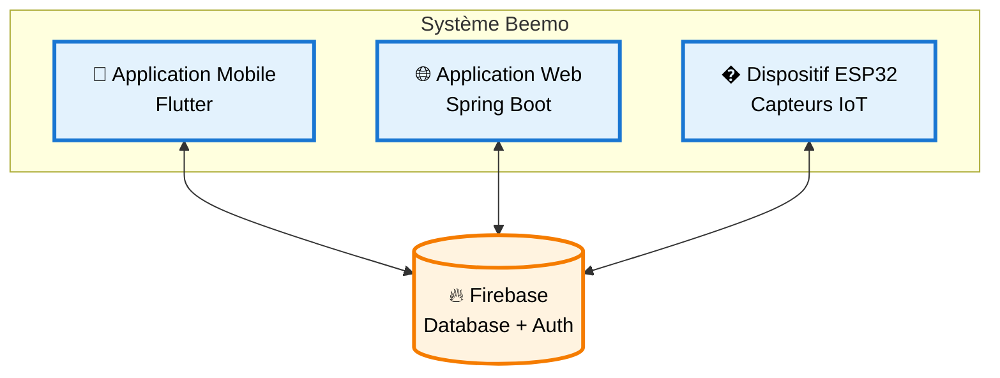
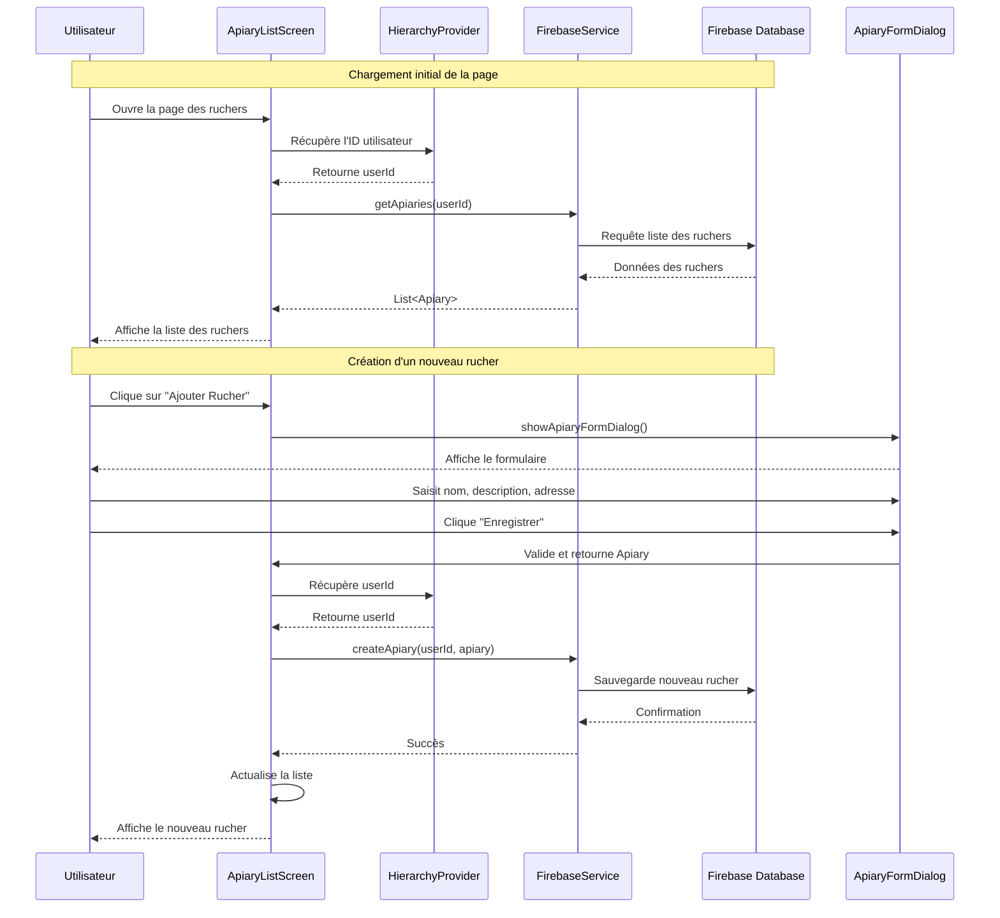

# Beemo - Système de Surveillance ESP32 pour Apiculture - Documentation du Projet

## Table des Matières

1. [Vue d'ensemble du Projet](#vue-densemble-du-projet)
2. [Architecture du Système](#architecture-du-système)
3. [Diagramme de Cas d'Usage](#diagramme-de-cas-dusage)
4. [Diagramme de Classes](#diagramme-de-classes)
5. [Flux de Données](#flux-de-données)
6. [Diagramme de Séquence - Création d'un Rucher](#diagramme-de-séquence---création-dun-rucher)
7. [Intégration Matérielle ESP32](#intégration-matérielle-esp32)
8. [Intégration Bluetooth (Théorique)](#intégration-bluetooth-théorique)
9. [Structure de la Base de Données Firebase](#structure-de-la-base-de-données-firebase)
10. [Référence API](#référence-api)
11. [Guide de Développement](#guide-de-développement)

## Vue d'ensemble du Projet

**Beemo** est une solution IoT complète pour l'apiculture qui combine trois applications principales pour surveiller les conditions des ruches en temps réel. Le système fournit une organisation hiérarchique (Utilisateur → Rucher → Ruche → Mesures) avec une intégration backend Firebase.

### Applications du Système Beemo

1. **Application Mobile Flutter** : Interface mobile native avec fonctionnalités d'appairage Bluetooth ESP32
2. **Application Web Spring Boot** : Interface web avec fonctionnalités d'administration avancées
3. **Dispositifs ESP32** : Capteurs matériels pour la surveillance en temps réel des ruches

### Fonctionnalités Clés

#### Application Mobile (Flutter)

- **Surveillance en temps réel** : Capteurs de température et d'humidité avec visualisation de données en direct
- **Organisation hiérarchique** : Structure multi-niveaux pour gérer plusieurs ruchers et ruches
- **Alertes basées sur les événements** : Seuils configurables avec détection d'événements intelligente
- **Appairage Bluetooth ESP32** : Configuration directe des dispositifs ESP32 via Bluetooth
- **Résilience hors ligne** : Mise en mémoire tampon de données locale avec synchronisation automatique
- **Interface moderne** : Design Material 3 avec localisation française

#### Application Web (Spring Boot)

- **Interface web responsive** : Accès via navigateur avec toutes les fonctionnalités de surveillance
- **Gestion d'administration** : Interface dédiée pour les utilisateurs avec rôle administrateur
- **Création de comptes utilisateurs** : Gestion centralisée des comptes Firebase par les administrateurs
- **Visualisation de données** : Graphiques et tableaux de bord pour l'analyse des données
- **Gestion des ruchers et ruches** : CRUD complet via interface web
- **Authentification unifiée** : Utilise les mêmes comptes Firebase que l'application mobile

## Architecture du Système



### Vue d'ensemble Simple

Le système **Beemo** est composé de **3 applications principales** qui communiquent toutes avec **Firebase** :

#### 📱 **Application Mobile Flutter**

- Interface mobile native
- Appairage Bluetooth ESP32
- Surveillance en temps réel

#### 🌐 **Application Web Spring Boot**

- Interface web responsive
- Fonctionnalités d'administration
- Gestion des utilisateurs

#### 🔧 **Dispositif ESP32**

- Capteurs de température/humidité
- Transmission WiFi des données
- Configuration à distance

#### � **Firebase (Centre de données)**

- **Database** : Stockage en temps réel
- **Authentication** : Gestion des utilisateurs
- **Configuration** : Paramètres des appareils

## Diagramme de Cas d'Usage

Le diagramme de cas d'usage présente les interactions entre les acteurs du système Beemo selon les conventions UML françaises avec relations d'héritage, d'inclusion et d'extension.

```mermaid
graph TB
    %% Acteurs
    User[Utilisateur]
    Admin[Administrateur]
    ESP32[Dispositif ESP32]

    %% Système Beemo
    subgraph "Système Beemo"
        %% Cas d'usage principaux
        S_Authentifier[S'Authentifier]

        %% Gestion des ruchers
        ConsulterRuchers[Consulter les Ruchers]
        CreerRucher[Créer un Rucher]
        ModifierRucher[Modifier un Rucher]
        SupprimerRucher[Supprimer un Rucher]

        %% Gestion des ruches
        ConsulterRuches[Consulter les Ruches]
        CreerRuche[Créer une Ruche]
        ModifierRuche[Modifier une Ruche]
        SupprimerRuche[Supprimer une Ruche]

        %% Surveillance et configuration
        ConsulterMesures[Consulter les Mesures]
        VisualiserGraphiques[Visualiser les Graphiques]
        ConfigurerSeuils[Configurer les Seuils]
        ConsulterEvenements[Consulter les Événements]

        %% Gestion ESP32 (Mobile uniquement)
        ApparierESP32[Apparier un ESP32]
        ConfigurerESP32[Configurer un ESP32]

        %% Administration (Admin uniquement)
        GererUtilisateurs[Gérer les Utilisateurs]
        CreerCompteUtilisateur[Créer un Compte Utilisateur]
        ModifierRoleUtilisateur[Modifier le Rôle Utilisateur]
        SupprimerUtilisateur[Supprimer un Utilisateur]
        ConsulterStatistiques[Consulter les Statistiques Système]

        %% Fonctionnalités ESP32
        CollecterDonnees[Collecter les Données Capteurs]
        TransmettreDonnees[Transmettre les Données]
        RecevoirConfiguration[Recevoir la Configuration]
        DetecterEvenements[Détecter les Événements]
        GererConnexion[Gérer la Connexion WiFi]
    end

    %% Relations des acteurs avec les cas d'usage
    User --> S_Authentifier
    User --> ConsulterRuchers
    User --> CreerRucher
    User --> ModifierRucher
    User --> SupprimerRucher
    User --> CreerRuche
    User --> ModifierRuche
    User --> SupprimerRuche
    User --> ApparierESP32

    %% Héritage : Admin hérite de User
    Admin -.->|hérite| User
    Admin --> GererUtilisateurs
    Admin --> ConsulterStatistiques

    %% Relations ESP32
    ESP32 --> CollecterDonnees
    ESP32 --> TransmettreDonnees
    ESP32 --> RecevoirConfiguration
    ESP32 --> DetecterEvenements
    ESP32 --> GererConnexion

    %% Relations d'inclusion (include)
    ConsulterRuchers -.->|include| S_Authentifier
    CreerRucher -.->|include| S_Authentifier
    ModifierRucher -.->|include| S_Authentifier
    SupprimerRucher -.->|include| S_Authentifier
    CreerRuche -.->|include| S_Authentifier
    ModifierRuche -.->|include| S_Authentifier
    SupprimerRuche -.->|include| S_Authentifier
    ApparierESP32 -.->|include| S_Authentifier
    GererUtilisateurs -.->|include| S_Authentifier
    ConsulterStatistiques -.->|include| S_Authentifier

    %% Relations d'extension (extend)
    ConsulterRuches -.->|extend| ConsulterRuchers
    ConsulterMesures -.->|extend| ConsulterRuches
    VisualiserGraphiques -.->|extend| ConsulterMesures
    ConsulterEvenements -.->|extend| ConsulterMesures
    ConfigurerSeuils -.->|extend| ConsulterMesures

    %% Décomposition de GererUtilisateurs
    GererUtilisateurs -.->|include| CreerCompteUtilisateur
    GererUtilisateurs -.->|include| ModifierRoleUtilisateur
    GererUtilisateurs -.->|include| SupprimerUtilisateur

    %% Configuration ESP32 étend l'appairage
    ConfigurerESP32 -.->|extend| ApparierESP32

    %% Styles UML standards
    classDef actor fill:#ffffff,stroke:#000000,stroke-width:2px
    classDef usecase fill:#ffffff,stroke:#000000,stroke-width:1px
    classDef system fill:#f0f0f0,stroke:#000000,stroke-width:2px

    class User,Admin,ESP32 actor
    class S_Authentifier,ConsulterRuchers,CreerRucher,ModifierRucher,SupprimerRucher,ConsulterRuches,CreerRuche,ModifierRuche,SupprimerRuche,ConsulterMesures,VisualiserGraphiques,ConfigurerSeuils,ConsulterEvenements,ApparierESP32,ConfigurerESP32,GererUtilisateurs,CreerCompteUtilisateur,ModifierRoleUtilisateur,SupprimerUtilisateur,ConsulterStatistiques,CollecterDonnees,TransmettreDonnees,RecevoirConfiguration,DetecterEvenements,GererConnexion usecase
```



### Description des Acteurs et Relations UML

#### **Acteurs**

**Utilisateur** : Apiculteur standard utilisant le système pour surveiller ses ruchers via mobile ou web.

**Administrateur** : Hérite de l'acteur Utilisateur (relation d'héritage UML). Possède tous les droits d'un utilisateur standard plus les fonctionnalités d'administration.

**Dispositif ESP32** : Acteur technique automatisé effectuant la surveillance physique des ruches.

#### **Relations UML**

##### **Héritage (Généralisation)**

- `Administrateur` **hérite** de `Utilisateur`
- L'administrateur a accès à tous les cas d'usage de l'utilisateur standard

##### **Relations d'Inclusion (include)**

- Les cas d'usage principaux (points d'entrée) **incluent** `S'Authentifier`
- `Gérer les Utilisateurs` **inclut** `Créer un Compte Utilisateur`, `Modifier le Rôle Utilisateur`, `Supprimer un Utilisateur`
- Les cas d'usage étendus héritent de l'authentification via leur parent

##### **Relations d'Extension (extend)**

- `Consulter les Ruches` **étend** `Consulter les Ruchers` (navigation hiérarchique)
- `Consulter les Mesures` **étend** `Consulter les Ruches` (navigation vers les données)
- `Visualiser les Graphiques` **étend** `Consulter les Mesures` (vue détaillée)
- `Consulter les Événements` **étend** `Consulter les Mesures` (vue filtrée)
- `Configurer les Seuils` **étend** `Consulter les Mesures` (configuration)
- `Configurer un ESP32` **étend** `Apparier un ESP32` (configuration après appairage)

#### **Flux de Navigation Principal**

```
1. S'Authentifier (requis pour les points d'entrée)
2. Consulter les Ruchers (point d'entrée principal)
   └── Consulter les Ruches (extension automatique)
       └── Consulter les Mesures (extension automatique)
           ├── Visualiser les Graphiques (extension optionnelle)
           ├── Consulter les Événements (extension optionnelle)
           └── Configurer les Seuils (extension optionnelle)
3. Apparier un ESP32 (point d'entrée mobile)
   └── Configurer un ESP32 (extension automatique)
```

#### **Principe de Simplification UML**

- **Utilisateur** → Lié uniquement aux cas d'usage **points d'entrée**
- **Extensions automatiques** → Accessibles via navigation hiérarchique
- **Authentification** → Incluse seulement dans les points d'entrée
- **Héritage d'authentification** → Les extensions héritent via leur parent

#### **Contraintes de Plateforme**

| Cas d'Usage                          | Mobile | Web | Contrainte                     |
| ------------------------------------ | ------ | --- | ------------------------------ |
| `Apparier un ESP32`                  | ✅     | ❌  | Bluetooth mobile uniquement    |
| `Configurer un ESP32`                | ✅     | ❌  | Suite de l'appairage Bluetooth |
| `Gérer les Utilisateurs`             | ❌     | ✅  | Privilèges administrateur web  |
| `Consulter les Statistiques Système` | ❌     | ✅  | Interface d'administration web |

#### **Cas d'Usage par Fréquence**

**Quotidiens** : `Consulter les Ruchers`, `Consulter les Ruches`, `Consulter les Mesures`

**Périodiques** : `Configurer les Seuils`, `Consulter les Événements`, `Visualiser les Graphiques`

**Occasionnels** : `Créer un Rucher`, `Créer une Ruche`, `Apparier un ESP32`

**Administratifs** : `Gérer les Utilisateurs`, `Consulter les Statistiques Système`

**Automatiques (ESP32)** : `Collecter les Données Capteurs`, `Transmettre les Données`, `Détecter les Événements`

### Spécifications Détaillées des Cas d'Usage

#### **Cas d'Usage Fondamentaux**

##### S'Authentifier

- **Précondition** : Aucune
- **Postcondition** : Utilisateur authentifié dans le système
- **Acteurs** : Utilisateur, Administrateur
- **Description** : Connexion via Firebase Auth (mobile/web)

##### Consulter les Ruchers

- **Précondition** : Utilisateur authentifié
- **Postcondition** : Liste des ruchers affichée
- **Acteurs** : Utilisateur, Administrateur
- **Include** : S'Authentifier

##### Consulter les Ruches

- **Précondition** : Rucher sélectionné
- **Postcondition** : Liste des ruches du rucher affichée
- **Acteurs** : Utilisateur, Administrateur
- **Extend** : Consulter les Ruchers
- **Include** : S'Authentifier

#### **Cas d'Usage de Gestion (CRUD)**

##### Créer un Rucher/Ruche

- **Précondition** : Utilisateur authentifié
- **Postcondition** : Nouvel élément créé et persisté
- **Acteurs** : Utilisateur, Administrateur
- **Include** : S'Authentifier

##### Modifier un Rucher/Ruche

- **Précondition** : Élément existant sélectionné
- **Postcondition** : Modifications sauvegardées
- **Acteurs** : Utilisateur, Administrateur
- **Include** : S'Authentifier

##### Supprimer un Rucher/Ruche

- **Précondition** : Élément existant sélectionné
- **Postcondition** : Élément supprimé du système
- **Acteurs** : Utilisateur, Administrateur
- **Include** : S'Authentifier

#### **Cas d'Usage de Surveillance**

##### Consulter les Mesures

- **Précondition** : Ruche sélectionnée
- **Postcondition** : Données de mesures affichées
- **Acteurs** : Utilisateur, Administrateur
- **Extend** : Consulter les Ruches
- **Include** : S'Authentifier

##### Visualiser les Graphiques

- **Précondition** : Mesures disponibles
- **Postcondition** : Graphiques de tendances affichés
- **Acteurs** : Utilisateur, Administrateur
- **Extend** : Consulter les Mesures

##### Configurer les Seuils

- **Précondition** : Ruche sélectionnée
- **Postcondition** : Nouveaux seuils appliqués à l'ESP32
- **Acteurs** : Utilisateur, Administrateur
- **Extend** : Consulter les Mesures
- **Include** : S'Authentifier

#### **Cas d'Usage Bluetooth (Mobile uniquement)**

##### Apparier un ESP32

- **Précondition** : ESP32 en mode appairage
- **Postcondition** : Connexion Bluetooth établie
- **Acteurs** : Utilisateur, Administrateur
- **Contrainte** : Mobile uniquement
- **Include** : S'Authentifier

##### Configurer un ESP32

- **Précondition** : ESP32 appairé
- **Postcondition** : Configuration WiFi/Firebase transmise
- **Acteurs** : Utilisateur, Administrateur
- **Extend** : Apparier un ESP32
- **Contrainte** : Mobile uniquement

#### **Cas d'Usage d'Administration (Web uniquement)**

##### Gérer les Utilisateurs

- **Précondition** : Administrateur authentifié
- **Postcondition** : Opération utilisateur effectuée
- **Acteurs** : Administrateur
- **Contrainte** : Web uniquement
- **Include** : S'Authentifier, Créer un Compte Utilisateur, Modifier le Rôle Utilisateur, Supprimer un Utilisateur

##### Consulter les Statistiques Système

- **Précondition** : Administrateur authentifié
- **Postcondition** : Statistiques globales affichées
- **Acteurs** : Administrateur
- **Contrainte** : Web uniquement
- **Include** : S'Authentifier

#### **Cas d'Usage ESP32 (Automatiques)**

##### Collecter les Données Capteurs

- **Précondition** : ESP32 alimenté et configuré
- **Postcondition** : Données collectées dans le tampon
- **Acteurs** : Dispositif ESP32
- **Fréquence** : Configurable (défaut: 60s)

##### Transmettre les Données

- **Précondition** : Données disponibles et connexion active
- **Postcondition** : Données envoyées vers Firebase
- **Acteurs** : Dispositif ESP32

##### Détecter les Événements

- **Précondition** : Seuils configurés
- **Postcondition** : Type d'événement déterminé
- **Acteurs** : Dispositif ESP32
- **Classification** : data, temp_event, hum_event, both_event, cover_opened

## Diagramme de Classes

```mermaid
classDiagram
    %% Core Authentication
    class AuthWrapper {
        +StreamBuilder~User~
        +handleAuthStateChanges()
        +redirectToLogin()
        +redirectToHome()
    }

    class LoginScreen {
        +TextEditingController emailController
        +TextEditingController passwordController
        +signInWithEmailPassword()
        +showErrorDialog()
    }

    %% Data Models
    class User {
        +String uid
        +String email
        +DateTime createdAt
    }

    class Apiary {
        +String name
        +String description
        +String address
        +DateTime createdAt
        +DateTime updatedAt
        +toJson()
        +fromJson()
        +copyWith()
    }

    class Hive {
        +String name
        +DateTime createdAt
        +String? esp32MacAddress
        +bool isConnected
        +DateTime? lastConnection
        +toJson()
        +fromJson()
        +copyWith()
    }

    class HiveConstants {
        +int temperature
        +int humidity
        +bool notify
        +int interval
        +toJson()
        +fromJson()
        +copyWith()
    }

    class MeasurementData {
        +String timestamp
        +int temperature
        +int humidity
        +String type
        +bool isEventType
        +toJson()
        +fromJson()
        +getEventMessage()
    }

    %% State Management
    class HierarchyProvider {
        +HierarchyContext context
        +bool isLoading
        +setCurrentUser()
        +setCurrentApiary()
        +setCurrentHive()
        +clearContext()
        +notifyListeners()
    }

    class HierarchyContext {
        +String? userId
        +String? apiaryName
        +String? hiveName
        +generatePath()
        +copyWith()
        +isComplete()
    }

    %% Services
    class FirebaseService {
        +createApiary()
        +updateApiary()
        +deleteApiary()
        +getApiaries()
        +createHive()
        +updateHive()
        +deleteHive()
        +getHives()
        +getMeasurements()
        +getHiveConstants()
        +updateHiveConstants()
        +migrateApiaryData()
    }

    %% Screens
    class HomeScreen {
        +GraphWidget temperatureChart
        +GraphWidget humidityChart
        +showThresholdModal()
        +showEventModal()
        +showBluetoothPairingDialog()
    }

    class ApiaryListScreen {
        +List~Apiary~ apiaries
        +showApiaryFormDialog()
        +deleteApiary()
        +navigateToHiveList()
    }

    class HiveListScreen {
        +List~Hive~ hives
        +showHiveFormDialog()
        +deleteHive()
        +navigateToHome()
        +showBluetoothPairing()
    }

    %% UI Widgets
    class GraphWidget {
        +List~MeasurementData~ data
        +String title
        +Color lineColor
        +double minY
        +double maxY
        +buildChart()
        +handleTouch()
    }

    class ThresholdModal {
        +HiveConstants constants
        +updateThresholds()
        +validateInput()
    }

    class EventModal {
        +List~MeasurementData~ events
        +showEventDetails()
        +filterByType()
    }

    %% Bluetooth Integration (Theoretical)
    class BluetoothService {
        +FlutterBluePlus bluetooth
        +scanForDevices()
        +connectToDevice()
        +sendCredentials()
        +disconnectDevice()
        +getDeviceStatus()
    }

    class BluetoothPairingDialog {
        +List~ScanResult~ availableDevices
        +scanForESP32()
        +selectDevice()
        +pairWithHive()
        +sendConfiguration()
        +showProgress()
    }

    class ESP32Device {
        +String macAddress
        +String name
        +bool isConnected
        +int rssi
        +BluetoothCharacteristic configCharacteristic
        +sendConfig()
        +receiveStatus()
    }

    class BluetoothConfig {
        +String userId
        +String apiaryName
        +String hiveName
        +String wifiSSID
        +String wifiPassword
        +String firebaseApiKey
        +String databaseUrl
        +toJson()
        +fromJson()
    }

    %% Spring Boot Web Application
    class WebAuthController {
        +login()
        +logout()
        +register()
        +getCurrentUser()
        +refreshToken()
    }

    class AdminController {
        +createUserAccount()
        +getUsersList()
        +updateUserRole()
        +deleteUser()
        +getUserStatistics()
    }

    class ApiaryWebController {
        +getApiariesView()
        +createApiaryForm()
        +updateApiaryForm()
        +deleteApiary()
        +getApiaryDetails()
    }

    class HiveWebController {
        +getHivesView()
        +createHiveForm()
        +updateHiveForm()
        +deleteHive()
        +getHiveDetails()
        +getHiveMeasurements()
    }

    class DashboardController {
        +getDashboardView()
        +getSystemStatistics()
        +getRecentEvents()
        +getAlertsOverview()
    }

    class WebFirebaseService {
        +authenticateUser()
        +createUser()
        +getApiaries()
        +getHives()
        +getMeasurements()
        +updateConfiguration()
        +getUserRole()
        +setUserRole()
    }

    class UserRole {
        +String userId
        +String role
        +DateTime createdAt
        +DateTime updatedAt
        +List~String~ permissions
    }

    %% Relationships
    AuthWrapper --> LoginScreen
    AuthWrapper --> HomeScreen
    LoginScreen --> User

    HierarchyProvider --> HierarchyContext
    HierarchyProvider --> User
    HierarchyProvider --> Apiary
    HierarchyProvider --> Hive

    FirebaseService --> Apiary
    FirebaseService --> Hive
    FirebaseService --> MeasurementData
    FirebaseService --> HiveConstants

    HomeScreen --> GraphWidget
    HomeScreen --> ThresholdModal
    HomeScreen --> EventModal
    HomeScreen --> BluetoothPairingDialog

    ApiaryListScreen --> Apiary
    HiveListScreen --> Hive
    HiveListScreen --> BluetoothPairingDialog

    BluetoothService --> ESP32Device
    BluetoothService --> BluetoothConfig
    BluetoothPairingDialog --> BluetoothService
    BluetoothPairingDialog --> ESP32Device

    %% Spring Boot Web App Relationships
    WebAuthController --> User
    WebAuthController --> UserRole
    AdminController --> User
    AdminController --> UserRole
    AdminController --> WebFirebaseService
    ApiaryWebController --> Apiary
    ApiaryWebController --> WebFirebaseService
    HiveWebController --> Hive
    HiveWebController --> WebFirebaseService
    DashboardController --> WebFirebaseService
    WebFirebaseService --> FirebaseService

    Hive --> ESP32Device : "paired device"
    ESP32Device --> BluetoothConfig : "receives config"
    User --> UserRole : "has role"
```



## Flux de Données

### 1. Flux d'Authentification

#### Application Mobile

```
Saisie Utilisateur → LoginScreen → Firebase Auth → AuthWrapper → HomeScreen/LoginScreen
```

#### Application Web

```
Saisie Utilisateur → WebAuthController → Firebase Auth → Dashboard/LoginPage
```

### 2. Flux de Gestion des Données

#### Application Mobile

```
Action Utilisateur → Écran → HierarchyProvider → FirebaseService → Base de Données Firebase
```

#### Application Web

```
Action Utilisateur → Controller Web → WebFirebaseService → Base de Données Firebase → Vue Web
```

### 3. Flux d'Administration (Web uniquement)

```
Admin → AdminController → WebFirebaseService → Firebase Auth + Custom Claims → Gestion Utilisateurs
```

### 4. Flux de Données ESP32 (Commun)

```
Capteurs ESP32 → WiFi → Base de Données Firebase → Application Flutter/Web → Graphiques UI
```

### 5. Flux d'Appairage Bluetooth (Mobile uniquement)

```
Écran Ruche → Bouton Bluetooth → Scanner Appareils → Sélectionner ESP32 → Envoyer Config → Appairage Terminé
```

## Diagramme de Séquence - Création d'un Rucher



## Intégration Matérielle ESP32

### Implémentation Actuelle (WiFi)

L'appareil ESP32 utilise actuellement une connexion WiFi avec une architecture robuste et optimisée pour la surveillance continue des ruches.

#### Composants Matériels

- **Capteur DHT11** (GPIO 15) : Surveillance de la température et de l'humidité
- **Bouton de Couvercle** (GPIO 22) : Détecte l'ouverture du couvercle de la ruche avec debouncing
- **Bouton de Réinitialisation WiFi** (GPIO 33) : Réinitialisation d'usine (pression longue 3+ secondes)
- **Module WiFi ESP32** : Connectivité Internet avec gestion automatique des reconnexions

#### Architecture Logicielle Détaillée

##### Gestion des Données et Résilience

- **Tampon Circulaire** : Stockage de 5 mesures maximum avec système FIFO
- **Structure DataRecord** : Horodatage (DD-MM-YYYY_HH:MM) + température + humidité
- **Transmission Différée** : Envoi automatique lors du retour de connexion
- **Synchronisation NTP** : Horodatage précis requis pour Firebase SSL

##### Configuration Dynamique Firebase

- **Seuils Configurables** :
  - `tempThreshold` (défaut: 30°C)
  - `humThreshold` (défaut: 80%)
  - `interval` (défaut: 60000ms)
  - `notifyEnabled` (défaut: true)
- **Mise à Jour en Temps Réel** : Récupération des constantes à chaque cycle
- **Path Firebase des mesures** : `userID/rucherName/rucheName/constants/`
- **Path Firebase des constantes** : `userID/rucherName/rucheName/mesurments/`

##### Détection d'Événements

- **Types d'événements** :
  - `"data"` : Mesure normale dans les seuils
  - `"temp_event"` : Température > seuil
  - `"hum_event"` : Humidité > seuil
  - `"both_event"` : Les deux seuils dépassés
  - `"cover_opened"` : Ouverture du couvercle détectée

##### Gestion de l'Alimentation et Connexion

- **WiFiManager** : Portail captif automatique "ESP32-Config"
- **Reconnexion Automatique** : Gestion des coupures réseau
- **Debouncing Matériel** : 50ms pour tous les boutons
- **Authentification Firebase** : Anonyme avec gestion des tokens

#### Identification et Configuration Actuelle

```cpp
// Configuration hardcodée (à remplacer par Bluetooth)
const char *userID = "AuCwrs4JriWNk3jserhfih2lR5j2";
const char *rucherName = "rucher_TEST";
const char *rucheName = "ruche_TEST";
```

#### Contraintes de Mémoire Actuelles

**État actuel après optimisation partielle :**

- **Mémoire programme** : ~95% de 1,310,720 bytes ⚠️ (Optimisation partielle effectuée)
- **Variables globales** : 65,544 bytes (20% de 327,680 bytes) ✅
- **Mémoire locale disponible** : 262,136 bytes ✅

**Problème persistant :** Malgré les optimisations effectuées (suppression des messages de debug et logique de débogage), l'espace mémoire restant (~5%) est insuffisant pour ajouter les fonctionnalités Bluetooth.

**Exemple d'erreur lors d'ajout de fonctionnalités :**

```
Sketch uses 2040831 bytes (155%) of program storage space. Maximum is 1310720 bytes.
Global variables use 65544 bytes (20%) of dynamic memory, leaving 262136 bytes for local variables. Maximum is 327680 bytes.
Sketch too big; see https://support.arduino.cc/hc/en-us/articles/360013825179 for tips on reducing it.
text section exceeds available space in board
```

#### Optimisations Réalisées et Limites Persistantes

**Optimisations partielles déjà effectuées :**

1. **Suppression Debug** : Retrait des messages Serial.print() et logique de débogage
2. **Nettoyage Code** : Suppression des fonctions et variables inutilisées
3. **Optimisation mineure** : Quelques améliorations de structure

**Espace mémoire restant :** Toujours ~5% (~65KB) - **Insuffisant pour Bluetooth**

**Défis techniques non résolus :**

- **BluetoothSerial** : Requiert toujours ~30-40KB
- **ArduinoJson** (parsing) : Requiert toujours ~20-30KB
- **Code d'appairage** : Requiert toujours ~10-15KB
- **Total estimé** : ~60-85KB (dépasse encore l'espace disponible)

**Limitations de l'optimisation actuelle :**

- Les bibliothèques Firebase et WiFiManager restent volumineuses
- L'architecture de base n'a pas été modifiée en profondeur
- Les optimisations "faciles" (debug) ont été épuisées

**Optimisations avancées nécessaires (non réalisées) :**

1. **Remplacement WiFiManager** : Par une implémentation custom (~200KB économisés)
2. **Optimisation Firebase profonde** : Buffers et fonctionnalités non utilisées (~150KB)
3. **Partitioning Flash personnalisé** : Réorganisation de l'espace mémoire
4. **Migration ESP32-WROVER** : Modèle avec 4MB Flash au lieu de 1.3MB

### Intégration Bluetooth (Théorique)

#### Défis Techniques Identifiés

**Contrainte Mémoire Persistante :**

- Le sketch reste à 95% de la capacité de stockage malgré l'optimisation partielle
- L'ajout de `BluetoothSerial` et `ArduinoJson` dépasse encore les 5% restants disponibles
- Les optimisations "faciles" (suppression debug) sont insuffisantes pour libérer l'espace requis

**Constat technique :** Les optimisations de surface ne suffisent pas - une refonte architecturale majeure serait nécessaire

- Optimisation supplémentaire ou choix d'architecture alternative requis

**Solutions alternatives possibles :**

1. **ESP32 avec plus de mémoire** : Utiliser un modèle ESP32-WROVER avec 4MB Flash
2. **Bluetooth minimal** : Implémentation sans ArduinoJson, parsing manuel
3. **Configuration par WiFi** : Remplacer le Bluetooth par un portail web de configuration
4. **Partition personnalisée** : Réorganiser l'espace Flash pour plus de code

#### Configuration Bluetooth Théorique

**Données à Recevoir via Bluetooth :**

```json
{
  "userID": "AuCwrs4JriWNk3jserhfih2lR5j2",
  "rucherName": "Mon_Rucher_Principal",
  "rucheName": "Ruche_Nord_01",
  "wifiSSID": "MonReseauWiFi",
  "wifiPassword": "MotDePasse123",
  "firebaseApiKey": "AIzaSy...",
  "databaseUrl": "https://esp32-bd-8ac4d-default-rtdb..."
}
```

**Processus d'Appairage Théorique :**

1. **Mode Découverte** : ESP32 démarre en mode Bluetooth discoverable
2. **Réception Config** : Application mobile envoie JSON de configuration
3. **Validation** : ESP32 vérifie et parse les données reçues
4. **Persistance EEPROM** : Sauvegarde pour les redémarrages
5. **Connexion WiFi** : Tentative de connexion avec nouveaux paramètres
6. **Confirmation** : Retour de statut vers l'application mobile

#### Optimisations Prioritaires

1. **WiFiManager → Solution Custom Ou envoye des identifiants WI-FI dans les JSON pas le bluetooth**
2. **String Optimization**
3. **Code Cleanup**

## Intégration Bluetooth (Théorique)

### Exigences pour l'Intégration Bluetooth

Pour implémenter la fonctionnalité d'appairage Bluetooth, les composants suivants seraient nécessaires :

### Modifications de l'Application Flutter

#### 1. Dépendances

```yaml
dependencies:
  flutter_bluetooth_serial: ^0.4.0
  # or
  flutter_blue_plus: ^1.12.0
```

#### 2. Nouvelles Classes

##### BluetoothService

**Objectif** : Gérer la communication Bluetooth avec les dispositifs ESP32

- Scanner et découvrir les appareils ESP32 disponibles
- Établir et maintenir les connexions Bluetooth
- Envoyer la configuration JSON aux ESP32 via les caractéristiques Bluetooth
- Gérer les erreurs de connexion et les timeouts

##### BluetoothConfig

**Objectif** : Structure de données pour la configuration des ESP32

- Contenir toutes les informations nécessaires pour configurer un ESP32
- Inclure les identifiants Firebase (userId, apiaryName, hiveName)
- Stocker les credentials WiFi (SSID, mot de passe)
- Fournir les clés d'API Firebase et URL de base de données
- Sérialiser les données en JSON pour transmission

##### BluetoothPairingDialog

**Objectif** : Interface utilisateur pour le processus d'appairage

- Afficher une liste des appareils ESP32 détectés avec leur signal
- Permettre la sélection d'un dispositif spécifique
- Collecter les informations WiFi de l'utilisateur
- Afficher le progrès de l'appairage en temps réel
- Confirmer le succès ou afficher les erreurs d'appairage

#### 3. Intégration UI

##### Modifications de HiveListScreen

**Objectif** : Ajouter les fonctionnalités Bluetooth à l'écran des ruches

- Afficher le statut de connexion Bluetooth pour chaque ruche
- Intégrer un bouton d'appairage pour les ruches non connectées
- Montrer l'indicateur de connexion active avec horodatage
- Déclencher le dialogue d'appairage lors du clic sur le bouton
- Mettre à jour l'interface après un appairage réussi

### Modifications Matérielles ESP32

#### 1. Bibliothèques Supplémentaires

```cpp
#include <BluetoothSerial.h>
#include <ArduinoJson.h>

BluetoothSerial SerialBT;
```

#### 2. Gestionnaire de Configuration Bluetooth

**Objectif** : Recevoir et traiter la configuration envoyée par l'application mobile

- Écouter les données JSON entrantes via Bluetooth
- Parser et valider la configuration reçue
- Extraire les paramètres WiFi et Firebase
- Sauvegarder la configuration en EEPROM pour persistance
- Confirmer la réception à l'application mobile

#### 3. Fonction Setup Améliorée

**Objectif** : Initialiser le module Bluetooth au démarrage

- Démarrer le service Bluetooth Serial avec un nom identifiable
- Charger la configuration existante depuis l'EEPROM
- Détecter si l'appareil est déjà configuré
- Basculer en mode appairage si nécessaire

#### 4. Mode Appairage

**Objectif** : Gérer l'état d'attente de configuration

- Indiquer visuellement que l'appareil est en mode appairage
- Rester en écoute des commandes Bluetooth
- Traiter la configuration reçue
- Passer en mode normal après configuration réussie

### Mises à Jour du Schéma de Base de Données

#### Extensions du Modèle Hive

**Objectif** : Étendre le modèle de données pour supporter le Bluetooth

- Ajouter l'adresse MAC de l'ESP32 appairé
- Inclure le statut de connexion en temps réel
- Stocker l'horodatage de la dernière connexion
- Enregistrer la version du firmware ESP32
- Optionnellement tracker le niveau de batterie

#### Extensions de Structure Firebase

**Objectif** : Adapter la base de données pour les configurations ESP32

- Créer une section esp32Config sous chaque ruche
- Stocker les informations de connexion Bluetooth
- Maintenir l'historique des connexions
- Permettre le suivi des mises à jour firmware

## Flux d'Appairage Bluetooth de l'Utilisateur

### 1. Écran de Gestion des Ruches

```
L'utilisateur navigue vers la Liste des Ruches → Voit les cartes de ruches avec le statut Bluetooth
```

### 2. Initiation de l'Appairage

```
L'utilisateur clique "Coupler ESP32" → BluetoothPairingDialog s'ouvre
```

### 3. Découverte d'Appareils

```
Le dialogue scanne les appareils ESP32 → Affiche la liste avec la force du signal
```

### 4. Sélection d'Appareil

```
L'utilisateur sélectionne l'appareil ESP32 → L'app tente la connexion
```

### 5. Transfert de Configuration

```
L'app envoie le JSON de configuration → L'ESP32 reçoit et valide
```

### 6. Configuration WiFi

```
L'ESP32 se connecte au WiFi → Confirme la connexion à l'app
```

### 7. Appairage Terminé

```
L'app met à jour le statut de la ruche → Affiche le message de succès → Ferme le dialogue
```

## Application Web Spring Boot

### Vue d'ensemble

L'application web Spring Boot fournit une interface utilisateur complète pour la gestion des ruchers via un navigateur web. Elle partage les mêmes données Firebase que l'application mobile mais offre des fonctionnalités d'administration supplémentaires.

### Fonctionnalités Principales

#### Interface Utilisateur Standard

- **Tableau de bord** : Vue d'ensemble des ruchers, ruches et données de capteurs
- **Gestion des ruchers** : CRUD complet via interface web responsive
- **Gestion des ruches** : Configuration et surveillance des ruches individuelles
- **Visualisation de données** : Graphiques interactifs pour les mesures de température et humidité
- **Gestion des seuils** : Configuration des alertes et paramètres par ruche
- **Historique des événements** : Consultation des alertes et événements système

#### Fonctionnalités d'Administration (Rôle Admin)

- **Création de comptes utilisateurs** : Interface pour créer de nouveaux utilisateurs Firebase
- **Gestion des rôles** : Attribution et modification des rôles utilisateur (user/admin)
- **Statistiques système** : Vue d'ensemble du nombre d'utilisateurs, ruchers, ruches actives
- **Monitoring global** : Surveillance de l'activité système et des dispositifs connectés

### Architecture Technique

#### Contrôleurs Spring Boot

- **WebAuthController** : Gestion de l'authentification Firebase
- **AdminController** : Fonctionnalités d'administration réservées aux admins
- **ApiaryWebController** : Gestion des ruchers via interface web
- **HiveWebController** : Gestion des ruches et visualisation des données
- **DashboardController** : Tableau de bord et statistiques

#### Services

- **WebFirebaseService** : Interface avec Firebase pour les opérations web
- **UserRoleService** : Gestion des rôles et permissions utilisateur
- **DataVisualizationService** : Préparation des données pour les graphiques web

#### Sécurité

- **Authentification Firebase** : Utilise les mêmes comptes que l'application mobile
- **Gestion des rôles** : Vérification des permissions pour les fonctionnalités admin
- **Protection CSRF** : Sécurisation des formulaires web
- **Sessions sécurisées** : Gestion des sessions utilisateur avec timeout

### Différences avec l'Application Mobile

| Fonctionnalité                   | Application Mobile    | Application Web        |
| -------------------------------- | --------------------- | ---------------------- |
| Appairage Bluetooth ESP32        | ✅ Disponible         | ❌ Non disponible      |
| Création de comptes utilisateurs | ❌ Non disponible     | ✅ Admin uniquement    |
| Gestion des rôles                | ❌ Non disponible     | ✅ Admin uniquement    |
| Surveillance en temps réel       | ✅ Optimisée mobile   | ✅ Interface desktop   |
| Gestion CRUD ruchers/ruches      | ✅ Interface tactile  | ✅ Interface web       |
| Visualisation de données         | ✅ Graphiques mobiles | ✅ Graphiques web      |
| Accès hors ligne                 | ✅ Tampon local       | ❌ Nécessite connexion |

## Structure de la Base de Données Firebase

### Structure Hiérarchique Actuelle

```json
{
  "user_id": {
    "apiary_name": {
      "address": "string",
      "description": "string",
      "hive_name": {
        "constants": {
          "humidity": "humidite",
          "interval": "en ms",
          "notify": "boolean",
          "temperature": "temperature"
        },
        "measurements": {
          "20-09-2025_09:10": {
            "data_package": {
              "humidity": "humidite",
              "temperature": "temperature"
            },
            "type": "data"
          }
        }
      }
    }
  }
}
```

### Explication de la Structure

#### 🏗️ **Organisation Hiérarchique**

```
user_id/                    ← Identifiant unique de l'utilisateur
├── apiary_name/           ← Nom du rucher
│   ├── address            ← Adresse du rucher
│   ├── description        ← Description du rucher
│   └── hive_name/         ← Nom de la ruche
│       ├── constants/     ← Configuration de la ruche
│       │   ├── humidity   ← Seuil d'humidité (%)
│       │   ├── interval   ← Intervalle de mesure (ms)
│       │   ├── notify     ← Notifications activées
│       │   └── temperature← Seuil de température (°C)
│       └── measurements/  ← Données des capteurs
│           └── timestamp/ ← Format: DD-MM-YYYY_HH:MM
│               ├── data_package/
│               │   ├── humidity    ← Humidité mesurée
│               │   └── temperature ← Température mesurée
│               └── type            ← Type: "data" | "event"
```

#### 📊 **Types de Données et Contraintes**

| Champ         | Type    | Description                  | Exemple                                                         | Contraintes ESP32          |
| ------------- | ------- | ---------------------------- | --------------------------------------------------------------- | -------------------------- |
| `user_id`     | string  | ID Firebase de l'utilisateur | "AuCwrs4JriWNk3jserhfih2lR5j2"                                  | Hardcodé actuellement      |
| `apiary_name` | string  | Nom du rucher                | "rucher_TEST"                                                   | Hardcodé actuellement      |
| `address`     | string  | Adresse physique             | "123 Rue des Abeilles"                                          | Géré par les apps          |
| `description` | string  | Description du rucher        | "Rucher de production"                                          | Géré par les apps          |
| `hive_name`   | string  | Nom de la ruche              | "ruche_TEST"                                                    | Hardcodé actuellement      |
| `humidity`    | number  | Seuil d'humidité (%)         | 80                                                              | Configurable en temps réel |
| `temperature` | number  | Seuil de température (°C)    | 30                                                              | Configurable en temps réel |
| `interval`    | number  | Intervalle de mesure (ms)    | 60000                                                           | Configurable en temps réel |
| `notify`      | boolean | Notifications activées       | true                                                            | Configurable en temps réel |
| `timestamp`   | string  | Horodatage des mesures       | "20-09-2025_09:10"                                              | Format NTP synchronisé     |
| `type`        | string  | Type d'événement             | "data", "temp_event", "hum_event", "both_event", "cover_opened" | Déterminé par ESP32        |

#### 🔧 **Logique des Types d'Événements ESP32**

**Classification automatique basée sur les seuils :**

- `"data"` : Température ≤ seuil ET Humidité ≤ seuil (mesure normale)
- `"temp_event"` : Température > seuil ET Humidité ≤ seuil
- `"hum_event"` : Température ≤ seuil ET Humidité > seuil
- `"both_event"` : Température > seuil ET Humidité > seuil (alerte critique)
- `"cover_opened"` : Événement bouton couvercle (temperature=0, humidity=0)

#### 📡 **Flux de Configuration ESP32**

**Path de récupération des constantes :**

```
{userID}/{rucherName}/{rucheName}/constants/
├── temperature    ← ESP32 lit et applique
├── humidity       ← ESP32 lit et applique
├── interval       ← ESP32 lit et applique
└── notify         ← ESP32 lit et applique
```

**Path d'envoi des mesures :**

```
{userID}/{rucherName}/{rucheName}/measurements/{timestamp}/
├── data_package/
│   ├── temperature ← Valeur capteur DHT11
│   └── humidity    ← Valeur capteur DHT11
└── type           ← Classification automatique
```

#### 💾 **Gestion du Tampon Circulaire ESP32**

**Structure interne ESP32 :**

```cpp
struct DataRecord {
    char timestamp[17];  // "DD-MM-YYYY_HH:MM"
    int temp;           // Température DHT11
    int hum;            // Humidité DHT11
};
DataRecord buffer[5]; // Tampon de 5 mesures max
```

**Résilience offline :**

- Stockage local si Firebase indisponible
- Transmission FIFO au retour de connexion
- Overwrite des anciennes données si tampon plein

````

## Référence API

### Méthodes FirebaseService (Mobile)

#### Gestion des Ruchers

```dart
Future<void> createApiary(String userId, Apiary apiary)
Future<void> updateApiary(String userId, String oldName, Apiary apiary)
Future<void> deleteApiary(String userId, String apiaryName)
Future<List<Apiary>> getApiaries(String userId)
````

#### Gestion des Ruches

```dart
Future<void> createHive(String userId, String apiaryName, Hive hive)
Future<void> updateHive(String userId, String apiaryName, String oldName, Hive hive)
Future<void> deleteHive(String userId, String apiaryName, String hiveName)
Future<List<Hive>> getHives(String userId, String apiaryName)
```

#### Données de Mesure

```dart
Future<List<MeasurementData>> getMeasurements(String userId, String apiaryName, String hiveName)
Future<HiveConstants> getHiveConstants(String userId, String apiaryName, String hiveName)
Future<void> updateHiveConstants(String userId, String apiaryName, String hiveName, HiveConstants constants)
```

### Méthodes HierarchyProvider (Mobile)

#### Gestion du Contexte

```dart
void setCurrentUser(String userId)
void setCurrentApiary(String apiaryName)
void setCurrentHive(String hiveName)
void clearContext()
bool isContextComplete()
String generateCurrentPath()
```

### API REST Spring Boot (Web)

#### Endpoints d'Authentification

```http
POST /api/auth/login
POST /api/auth/logout
GET /api/auth/current-user
POST /api/auth/refresh-token
```

#### Endpoints d'Administration (Admin uniquement)

```http
POST /api/admin/users
GET /api/admin/users
PUT /api/admin/users/{userId}/role
DELETE /api/admin/users/{userId}
GET /api/admin/statistics
```

#### Endpoints des Ruchers

```http
GET /api/apiaries
POST /api/apiaries
PUT /api/apiaries/{apiaryName}
DELETE /api/apiaries/{apiaryName}
GET /api/apiaries/{apiaryName}/details
```

#### Endpoints des Ruches

```http
GET /api/apiaries/{apiaryName}/hives
POST /api/apiaries/{apiaryName}/hives
PUT /api/apiaries/{apiaryName}/hives/{hiveName}
DELETE /api/apiaries/{apiaryName}/hives/{hiveName}
GET /api/apiaries/{apiaryName}/hives/{hiveName}/measurements
PUT /api/apiaries/{apiaryName}/hives/{hiveName}/constants
```

#### Endpoints du Tableau de Bord

```http
GET /api/dashboard/overview
GET /api/dashboard/recent-events
GET /api/dashboard/alerts
GET /api/dashboard/system-status
```

## Guide de Développement

### Configuration du Projet Beemo

Le projet Beemo est composé de trois applications principales qui doivent être configurées pour fonctionner ensemble :

1. **Application Mobile Flutter**
2. **Application Web Spring Boot**
3. **Firmware ESP32**

### Configuration du Développement Mobile (Flutter)

#### Configuration du Développement Bluetooth

#### 1. Ajouter les Dépendances

```yaml
# pubspec.yaml
dependencies:
  flutter_blue_plus: ^1.12.0
  permission_handler: ^10.2.0
```

#### 2. Configurer les Permissions

##### Android (android/app/src/main/AndroidManifest.xml)

```xml
<uses-permission android:name="android.permission.BLUETOOTH" />
<uses-permission android:name="android.permission.BLUETOOTH_ADMIN" />
<uses-permission android:name="android.permission.ACCESS_COARSE_LOCATION" />
<uses-permission android:name="android.permission.ACCESS_FINE_LOCATION" />
<uses-permission android:name="android.permission.BLUETOOTH_SCAN" />
<uses-permission android:name="android.permission.BLUETOOTH_CONNECT" />
```

##### iOS (ios/Runner/Info.plist)

```xml
<key>NSBluetoothAlwaysUsageDescription</key>
<string>Cette app a besoin du Bluetooth pour s'apparier avec les appareils ESP32</string>
<key>NSBluetoothPeripheralUsageDescription</key>
<string>Cette app a besoin du Bluetooth pour s'apparier avec les appareils ESP32</string>
```

#### 3. Étapes d'Implémentation

1. **Créer BluetoothService** : Gérer le scan d'appareils et la communication
2. **Concevoir BluetoothPairingDialog** : Interface utilisateur pour le processus d'appairage
3. **Mettre à jour le Modèle Hive** : Ajouter les champs liés au Bluetooth
4. **Modifier HiveListScreen** : Ajouter le bouton d'appairage et l'affichage du statut
5. **Mettre à jour FirebaseService** : Gérer le stockage de configuration ESP32
6. **Tester l'Intégration** : Vérifier le flux d'appairage de bout en bout

### Configuration du Développement Web (Spring Boot)

#### 1. Dépendances Maven

```xml
<!-- pom.xml -->
<dependencies>
    <dependency>
        <groupId>org.springframework.boot</groupId>
        <artifactId>spring-boot-starter-web</artifactId>
    </dependency>
    <dependency>
        <groupId>org.springframework.boot</groupId>
        <artifactId>spring-boot-starter-security</artifactId>
    </dependency>
    <dependency>
        <groupId>org.springframework.boot</groupId>
        <artifactId>spring-boot-starter-thymeleaf</artifactId>
    </dependency>
    <dependency>
        <groupId>com.google.firebase</groupId>
        <artifactId>firebase-admin</artifactId>
        <version>9.2.0</version>
    </dependency>
    <dependency>
        <groupId>org.springframework.boot</groupId>
        <artifactId>spring-boot-starter-websocket</artifactId>
    </dependency>
</dependencies>
```

#### 2. Configuration Firebase

```java
// FirebaseConfig.java
@Configuration
public class FirebaseConfig {

    @PostConstruct
    public void initialize() {
        try {
            FileInputStream serviceAccount = new FileInputStream("firebase-service-account.json");
            FirebaseOptions options = FirebaseOptions.builder()
                .setCredentials(GoogleCredentials.fromStream(serviceAccount))
                .setDatabaseUrl("https://esp32-bd-8ac4d-default-rtdb.europe-west1.firebasedatabase.app/")
                .build();
            FirebaseApp.initializeApp(options);
        } catch (Exception e) {
            e.printStackTrace();
        }
    }
}
```

#### 3. Configuration de Sécurité

```java
// SecurityConfig.java
@Configuration
@EnableWebSecurity
public class SecurityConfig {

    @Bean
    public SecurityFilterChain filterChain(HttpSecurity http) throws Exception {
        http
            .authorizeHttpRequests(authz -> authz
                .requestMatchers("/admin/**").hasRole("ADMIN")
                .requestMatchers("/api/admin/**").hasRole("ADMIN")
                .requestMatchers("/login", "/register").permitAll()
                .anyRequest().authenticated()
            )
            .oauth2Login(oauth2 -> oauth2
                .loginPage("/login")
                .defaultSuccessUrl("/dashboard")
            )
            .logout(logout -> logout
                .logoutSuccessUrl("/login")
            );
        return http.build();
    }
}
```

#### 4. Contrôleurs Principaux

```java
// DashboardController.java
@Controller
public class DashboardController {

    @Autowired
    private WebFirebaseService firebaseService;

    @GetMapping("/dashboard")
    public String dashboard(Model model, Authentication auth) {
        // Charger les données du tableau de bord
        return "dashboard";
    }
}

// AdminController.java
@RestController
@RequestMapping("/api/admin")
@PreAuthorize("hasRole('ADMIN')")
public class AdminController {

    @PostMapping("/users")
    public ResponseEntity<String> createUser(@RequestBody UserCreateRequest request) {
        // Créer un nouveau utilisateur Firebase
        return ResponseEntity.ok("User created");
    }
}
```

### Configuration de Développement ESP32

#### 1. Bibliothèques Requises

```cpp
// platformio.ini or Arduino IDE Library Manager
lib_deps =
    winlinvip/SimpleDHT@^1.0.15
    firebase-esp-client@^4.4.14
    ArduinoJson@^6.21.3
    BluetoothSerial  // ESP32 intégré
```

#### 2. Gestion de Configuration

Implémenter le stockage EEPROM pour une configuration persistante :

```cpp
#include <EEPROM.h>

struct Config {
  char userId[128];
  char apiaryName[64];
  char hiveName[64];
  char wifiSSID[32];
  char wifiPassword[64];
  bool isConfigured;
};

void saveConfigToEEPROM(Config config);
Config loadConfigFromEEPROM();
```

#### 3. Gestion d'Erreurs Améliorée

```cpp
void handleWiFiReconnection();
void handleFirebaseReconnection();
void handleBluetoothTimeout();
void reportStatusToApp();
```

Cette documentation fournit une vue d'ensemble complète du système actuel et de l'intégration Bluetooth théorique. Le diagramme de classes montre comment les nouveaux composants Bluetooth s'intégreraient avec l'architecture existante tout en maintenant une séparation claire des préoccupations.
