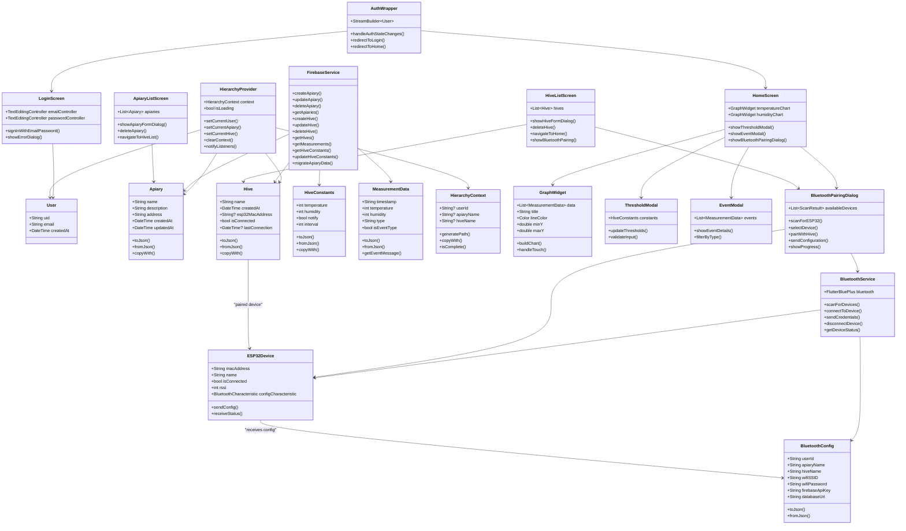

# ESP32 Beekeeping Monitoring System - Project Documentation

## Table of Contents

1. [Project Overview](#project-overview)
2. [System Architecture](#system-architecture)
3. [Class Diagram](#class-diagram)
4. [Data Flow](#data-flow)
5. [ESP32 Hardware Integration](#esp32-hardware-integration)
6. [Bluetooth Integration (Theoretical)](#bluetooth-integration-theoretical)
7. [Firebase Database Structure](#firebase-database-structure)
8. [API Reference](#api-reference)
9. [Development Guide](#development-guide)

## Project Overview

The ESP32 Beekeeping Monitoring System is a comprehensive IoT solution that combines Flutter mobile application with ESP32 hardware sensors to monitor beehive conditions in real-time. The system provides hierarchical organization (User → Apiary → Hive → Measurements) with Firebase backend integration.

### Key Features

- **Real-time monitoring**: Temperature and humidity sensors with live data visualization
- **Hierarchical organization**: Multi-level structure for managing multiple apiaries and hives
- **Event-driven alerts**: Configurable thresholds with intelligent event detection
- **Offline resilience**: Local data buffering with automatic synchronization
- **User authentication**: Secure Firebase authentication with user isolation
- **Modern UI**: Material 3 design with French localization
- **Production-ready**: Comprehensive testing with 54 unit tests

## System Architecture

```
┌─────────────────┐    ┌─────────────────┐    ┌─────────────────┐
│   Flutter App   │    │   Firebase      │    │   ESP32 Device  │
│                 │    │   (Realtime DB) │    │                 │
│ • Authentication│◄──►│ • User Data     │◄──►│ • DHT11 Sensor  │
│ • State Mgmt    │    │ • Measurements  │    │ • WiFi Manager  │
│ • UI/Charts     │    │ • Configuration │    │ • Offline Buffer│
│ • CRUD Ops      │    │ • Events        │    │ • Cover Detection│
└─────────────────┘    └─────────────────┘    └─────────────────┘
```

## Class Diagram



## Data Flow

### 1. Authentication Flow

```
User Input → LoginScreen → Firebase Auth → AuthWrapper → HomeScreen/LoginScreen
```

### 2. Data Management Flow

```
User Action → Screen → HierarchyProvider → FirebaseService → Firebase Database
```

### 3. ESP32 Data Flow (Current)

```
ESP32 Sensors → WiFi → Firebase Database → Flutter App → UI Charts
```

### 4. Bluetooth Pairing Flow (Theoretical)

```
Hive Screen → Bluetooth Button → Scan Devices → Select ESP32 → Send Config → Pair Complete
```

## ESP32 Hardware Integration

### Current Implementation (WiFi-based)

The ESP32 device currently uses WiFi for connectivity with the following features:

#### Hardware Components

- **DHT11 Sensor** (GPIO 15): Temperature and humidity monitoring
- **Cover Button** (GPIO 22): Detects hive cover opening
- **WiFi Reset Button** (GPIO 33): Factory reset functionality
- **WiFi Module**: Built-in ESP32 WiFi for internet connectivity

#### Key Features

- **Automatic WiFi Management**: WiFiManager library with captive portal
- **Offline Data Buffering**: Circular buffer for connectivity resilience
- **Real-time Configuration**: Firebase-based threshold and interval updates
- **Event Detection**: Smart event classification based on sensor thresholds
- **Time Synchronization**: NTP-based timestamping for accurate measurements

#### Data Structure

```cpp
struct DataRecord {
    char timestamp[17];  // DD-MM-YYYY_HH:MM format
    int temp;           // Temperature in Celsius
    int hum;            // Humidity percentage
};
```

### ESP32 Code Architecture

```cpp
// Main components
- WiFiManager: Automatic WiFi connection with captive portal
- Firebase Client: Real-time database integration
- SimpleDHT: Sensor data acquisition
- Circular Buffer: Offline data storage
- Button Handlers: Cover detection and WiFi reset
- Configuration Sync: Remote threshold management
```

## Bluetooth Integration (Theoretical)

### Requirements for Bluetooth Integration

To implement Bluetooth pairing functionality, the following components would be needed:

### Flutter App Modifications

#### 1. Dependencies

```yaml
dependencies:
  flutter_bluetooth_serial: ^0.4.0
  # or
  flutter_blue_plus: ^1.12.0
```

#### 2. New Classes

##### BluetoothService

```dart
class BluetoothService {
  static const String SERVICE_UUID = "12345678-1234-1234-1234-123456789abc";
  static const String CONFIG_CHARACTERISTIC = "87654321-4321-4321-4321-cba987654321";

  Future<List<BluetoothDevice>> scanForESP32Devices() async {
    // Scan for devices with ESP32 identifier
  }

  Future<bool> connectToDevice(BluetoothDevice device) async {
    // Establish Bluetooth connection
  }

  Future<bool> sendConfiguration(BluetoothConfig config) async {
    // Send JSON configuration via Bluetooth characteristic
  }
}
```

##### BluetoothConfig

```dart
class BluetoothConfig {
  final String userId;
  final String apiaryName;
  final String hiveName;
  final String firebaseApiKey;
  final String databaseUrl;
  final String wifiSSID;
  final String wifiPassword;

  Map<String, dynamic> toJson() => {
    'userId': userId,
    'apiaryName': apiaryName,
    'hiveName': hiveName,
    'firebaseApiKey': firebaseApiKey,
    'databaseUrl': databaseUrl,
    'wifiSSID': wifiSSID,
    'wifiPassword': wifiPassword,
  };
}
```

##### BluetoothPairingDialog

```dart
class BluetoothPairingDialog extends StatefulWidget {
  final String userId;
  final String apiaryName;
  final String hiveName;

  // UI for:
  // - Scanning for ESP32 devices
  // - Displaying available devices with signal strength
  // - WiFi credentials input
  // - Pairing progress indicator
  // - Success/failure feedback
}
```

#### 3. UI Integration

##### HiveListScreen Modifications

```dart
class HiveListScreen extends StatelessWidget {
  Widget _buildHiveCard(Hive hive) {
    return Card(
      child: Column(
        children: [
          // ...existing hive info...

          // Bluetooth pairing button
          ElevatedButton.icon(
            icon: Icon(hive.isConnected ? Icons.bluetooth_connected : Icons.bluetooth),
            label: Text(hive.isConnected ? 'Connecté' : 'Coupler ESP32'),
            onPressed: () => _showBluetoothPairingDialog(hive),
          ),

          // Connection status
          if (hive.isConnected)
            Text('Dernière connexion: ${_formatLastConnection(hive.lastConnection)}'),
        ],
      ),
    );
  }

  void _showBluetoothPairingDialog(Hive hive) {
    showDialog(
      context: context,
      builder: (context) => BluetoothPairingDialog(
        userId: context.read<HierarchyProvider>().context.userId!,
        apiaryName: context.read<HierarchyProvider>().context.apiaryName!,
        hiveName: hive.name,
      ),
    );
  }
}
```

### ESP32 Hardware Modifications

#### 1. Additional Libraries

```cpp
#include <BluetoothSerial.h>
#include <ArduinoJson.h>

BluetoothSerial SerialBT;
```

#### 2. Bluetooth Configuration Handler

```cpp
void handleBluetoothConfig() {
  if (SerialBT.available()) {
    String configJson = SerialBT.readString();

    DynamicJsonDocument doc(1024);
    deserializeJson(doc, configJson);

    // Extract configuration
    String newUserId = doc["userId"];
    String newApiaryName = doc["apiaryName"];
    String newHiveName = doc["hiveName"];
    String newWifiSSID = doc["wifiSSID"];
    String newWifiPassword = doc["wifiPassword"];

    // Update global variables
    userID = newUserId.c_str();
    rucherName = newApiaryName.c_str();
    rucheName = newHiveName.c_str();

    // Save to EEPROM for persistence
    saveConfigToEEPROM();

    // Connect to new WiFi
    connectToWiFi(newWifiSSID, newWifiPassword);

    // Send confirmation
    SerialBT.println("CONFIG_RECEIVED_OK");
  }
}
```

#### 3. Enhanced Setup Function

```cpp
void setup() {
  // ...existing setup...

  // Initialize Bluetooth
  SerialBT.begin("ESP32_Hive_" + String(WiFi.macAddress()));

  // Load saved configuration from EEPROM
  loadConfigFromEEPROM();

  // Start in pairing mode if not configured
  if (!isConfigured()) {
    startPairingMode();
  }
}
```

#### 4. Pairing Mode

```cpp
void startPairingMode() {
  Serial.println("Starting Bluetooth pairing mode...");

  // Blink LED to indicate pairing mode
  // Wait for Bluetooth configuration
  while (!isConfigured()) {
    handleBluetoothConfig();
    delay(100);
  }

  Serial.println("Configuration received, connecting to WiFi...");
}
```

### Database Schema Updates

#### Hive Model Extensions

```dart
class Hive {
  // ...existing fields...

  final String? esp32MacAddress;    // MAC address of paired ESP32
  final bool isConnected;           // Current connection status
  final DateTime? lastConnection;   // Last seen timestamp
  final String? firmwareVersion;    // ESP32 firmware version
  final int? batteryLevel;          // Battery percentage (if applicable)

  // ...existing methods...
}
```

#### Firebase Structure Extensions

```
users/
  {uid}/
    {apiaryName}/
      {hiveName}/
        name: string
        createdAt: timestamp
        esp32Config/
          macAddress: string
          isConnected: boolean
          lastConnection: timestamp
          firmwareVersion: string
          batteryLevel: number
        measurements/
          {timestamp}/...
        constants/...
```

## Bluetooth Pairing User Flow

### 1. Hive Management Screen

```
User navigates to Hive List → Sees hive cards with Bluetooth status
```

### 2. Pairing Initiation

```
User clicks "Coupler ESP32" → BluetoothPairingDialog opens
```

### 3. Device Discovery

```
Dialog scans for ESP32 devices → Shows list with signal strength
```

### 4. Device Selection

```
User selects ESP32 device → App attempts connection
```

### 5. Configuration Transfer

```
App sends configuration JSON → ESP32 receives and validates
```

### 6. WiFi Setup

```
ESP32 connects to WiFi → Confirms connection to app
```

### 7. Pairing Complete

```
App updates hive status → Shows success message → Closes dialog
```

## Firebase Database Structure

### Current Hierarchical Structure

```json
{
  "users": {
    "{uid}": {
      "{apiaryName}": {
        "description": "string",
        "address": "string",
        "createdAt": "timestamp",
        "updatedAt": "timestamp",
        "{hiveName}": {
          "name": "string",
          "createdAt": "timestamp",
          "measurements": {
            "{DD-MM-YYYY_HH:MM}": {
              "data_package": {
                "temperature": "number",
                "humidity": "number"
              },
              "type": "data|temp_event|hum_event|both_event|cover_opened",
              "isEventType": "boolean"
            }
          },
          "constants": {
            "temperature": "number",
            "humidity": "number",
            "notify": "boolean",
            "interval": "number"
          }
        }
      }
    }
  }
}
```

## API Reference

### FirebaseService Methods

#### Apiary Management

```dart
Future<void> createApiary(String userId, Apiary apiary)
Future<void> updateApiary(String userId, String oldName, Apiary apiary)
Future<void> deleteApiary(String userId, String apiaryName)
Future<List<Apiary>> getApiaries(String userId)
```

#### Hive Management

```dart
Future<void> createHive(String userId, String apiaryName, Hive hive)
Future<void> updateHive(String userId, String apiaryName, String oldName, Hive hive)
Future<void> deleteHive(String userId, String apiaryName, String hiveName)
Future<List<Hive>> getHives(String userId, String apiaryName)
```

#### Measurement Data

```dart
Future<List<MeasurementData>> getMeasurements(String userId, String apiaryName, String hiveName)
Future<HiveConstants> getHiveConstants(String userId, String apiaryName, String hiveName)
Future<void> updateHiveConstants(String userId, String apiaryName, String hiveName, HiveConstants constants)
```

### HierarchyProvider Methods

#### Context Management

```dart
void setCurrentUser(String userId)
void setCurrentApiary(String apiaryName)
void setCurrentHive(String hiveName)
void clearContext()
bool isContextComplete()
String generateCurrentPath()
```

## Development Guide

### Setting Up Bluetooth Development

#### 1. Add Dependencies

```yaml
# pubspec.yaml
dependencies:
  flutter_blue_plus: ^1.12.0
  permission_handler: ^10.2.0
```

#### 2. Configure Permissions

##### Android (android/app/src/main/AndroidManifest.xml)

```xml
<uses-permission android:name="android.permission.BLUETOOTH" />
<uses-permission android:name="android.permission.BLUETOOTH_ADMIN" />
<uses-permission android:name="android.permission.ACCESS_COARSE_LOCATION" />
<uses-permission android:name="android.permission.ACCESS_FINE_LOCATION" />
<uses-permission android:name="android.permission.BLUETOOTH_SCAN" />
<uses-permission android:name="android.permission.BLUETOOTH_CONNECT" />
```

##### iOS (ios/Runner/Info.plist)

```xml
<key>NSBluetoothAlwaysUsageDescription</key>
<string>This app needs Bluetooth to pair with ESP32 devices</string>
<key>NSBluetoothPeripheralUsageDescription</key>
<string>This app needs Bluetooth to pair with ESP32 devices</string>
```

#### 3. Implementation Steps

1. **Create BluetoothService**: Handle device scanning and communication
2. **Design BluetoothPairingDialog**: User interface for pairing process
3. **Update Hive Model**: Add Bluetooth-related fields
4. **Modify HiveListScreen**: Add pairing button and status display
5. **Update FirebaseService**: Handle ESP32 configuration storage
6. **Test Integration**: Verify end-to-end pairing workflow

### ESP32 Development Setup

#### 1. Required Libraries

```cpp
// platformio.ini or Arduino IDE Library Manager
lib_deps =
    winlinvip/SimpleDHT@^1.0.15
    firebase-esp-client@^4.4.14
    ArduinoJson@^6.21.3
    BluetoothSerial  // ESP32 built-in
```

#### 2. Configuration Management

Implement EEPROM storage for persistent configuration:

```cpp
#include <EEPROM.h>

struct Config {
  char userId[128];
  char apiaryName[64];
  char hiveName[64];
  char wifiSSID[32];
  char wifiPassword[64];
  bool isConfigured;
};

void saveConfigToEEPROM(Config config);
Config loadConfigFromEEPROM();
```

#### 3. Enhanced Error Handling

```cpp
void handleWiFiReconnection();
void handleFirebaseReconnection();
void handleBluetoothTimeout();
void reportStatusToApp();
```

This documentation provides a comprehensive overview of the current system and the theoretical Bluetooth integration. The class diagram shows how the new Bluetooth components would integrate with the existing architecture while maintaining clean separation of concerns.
