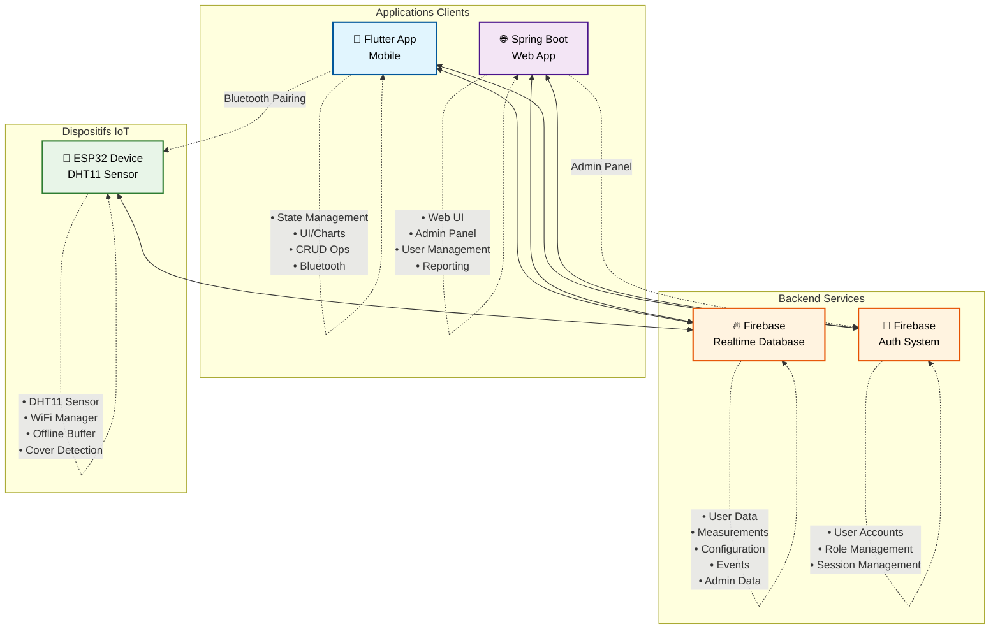
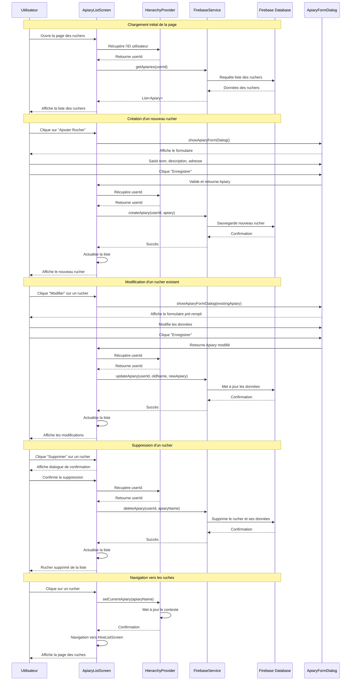

# Beemo - Système de Surveillance ESP32 pour Apiculture - Documentation du Projet

## Table des Matières

1. [Vue d'ensemble du Projet](#vue-densemble-du-projet)
2. [Architecture du Système](#architecture-du-système)
3. [Diagramme de Classes](#diagramme-de-classes)
4. [Flux de Données](#flux-de-données)
5. [Diagramme de Séquence - Page Liste des Ruchers](#diagramme-de-séquence---page-liste-des-ruchers)
6. [Intégration Matérielle ESP32](#intégration-matérielle-esp32)
7. [Intégration Bluetooth (Théorique)](#intégration-bluetooth-théorique)
8. [Structure de la Base de Données Firebase](#structure-de-la-base-de-données-firebase)
9. [Référence API](#référence-api)
10. [Guide de Développement](#guide-de-développement)

## Vue d'ensemble du Projet

**Beemo** est une solution IoT complète pour l'apiculture qui combine trois applications principales pour surveiller les conditions des ruches en temps réel. Le système fournit une organisation hiérarchique (Utilisateur → Rucher → Ruche → Mesures) avec une intégration backend Firebase.

### Applications du Système Beemo

1. **Application Mobile Flutter** : Interface mobile native avec fonctionnalités d'appairage Bluetooth ESP32
2. **Application Web Spring Boot** : Interface web avec fonctionnalités d'administration avancées
3. **Dispositifs ESP32** : Capteurs matériels pour la surveillance en temps réel des ruches

### Fonctionnalités Clés

#### Application Mobile (Flutter)

- **Surveillance en temps réel** : Capteurs de température et d'humidité avec visualisation de données en direct
- **Organisation hiérarchique** : Structure multi-niveaux pour gérer plusieurs ruchers et ruches
- **Alertes basées sur les événements** : Seuils configurables avec détection d'événements intelligente
- **Appairage Bluetooth ESP32** : Configuration directe des dispositifs ESP32 via Bluetooth
- **Résilience hors ligne** : Mise en mémoire tampon de données locale avec synchronisation automatique
- **Interface moderne** : Design Material 3 avec localisation française

#### Application Web (Spring Boot)

- **Interface web responsive** : Accès via navigateur avec toutes les fonctionnalités de surveillance
- **Gestion d'administration** : Interface dédiée pour les utilisateurs avec rôle administrateur
- **Création de comptes utilisateurs** : Gestion centralisée des comptes Firebase par les administrateurs
- **Visualisation de données** : Graphiques et tableaux de bord pour l'analyse des données
- **Gestion des ruchers et ruches** : CRUD complet via interface web
- **Authentification unifiée** : Utilise les mêmes comptes Firebase que l'application mobile

#### Dispositifs ESP32

- **Authentification utilisateur** : Authentification Firebase sécurisée avec isolation des utilisateurs
- **Prêt pour la production** : Tests complets avec 54 tests unitaires (application mobile)

## Architecture du Système



### Vue d'ensemble de l'Architecture

Le système **Beemo** est construit sur une architecture distribuée moderne qui sépare clairement les responsabilités :

#### 🏗️ **Couches d'Architecture**

1. **Couche Présentation**

   - Application mobile Flutter (interface tactile native)
   - Application web Spring Boot (interface navigateur responsive)

2. **Couche Services Backend**

   - Firebase Realtime Database (stockage de données en temps réel)
   - Firebase Authentication (gestion des utilisateurs et rôles)

3. **Couche IoT**
   - Dispositifs ESP32 avec capteurs DHT11
   - Communication WiFi bidirectionnelle

#### 🔄 **Flux de Communication**

- **Authentification Unifiée** : Les deux applications partagent le même système d'authentification Firebase
- **Données Synchronisées** : Accès en temps réel aux mêmes données depuis mobile et web
- **Configuration Dynamique** : Les ESP32 reçoivent leur configuration depuis Firebase
- **Appairage Bluetooth** : Exclusif à l'application mobile pour configurer les ESP32

## Diagramme de Classes


## Flux de Données

### 1. Flux d'Authentification

#### Application Mobile

```
Saisie Utilisateur → LoginScreen → Firebase Auth → AuthWrapper → HomeScreen/LoginScreen
```

#### Application Web

```
Saisie Utilisateur → WebAuthController → Firebase Auth → Dashboard/LoginPage
```

### 2. Flux de Gestion des Données

#### Application Mobile

```
Action Utilisateur → Écran → HierarchyProvider → FirebaseService → Base de Données Firebase
```

#### Application Web

```
Action Utilisateur → Controller Web → WebFirebaseService → Base de Données Firebase → Vue Web
```

### 3. Flux d'Administration (Web uniquement)

```
Admin → AdminController → WebFirebaseService → Firebase Auth + Custom Claims → Gestion Utilisateurs
```

### 4. Flux de Données ESP32 (Commun)

```
Capteurs ESP32 → WiFi → Base de Données Firebase → Application Flutter/Web → Graphiques UI
```

### 5. Flux d'Appairage Bluetooth (Mobile uniquement)

```
Écran Ruche → Bouton Bluetooth → Scanner Appareils → Sélectionner ESP32 → Envoyer Config → Appairage Terminé
```

## Diagramme de Séquence - Page Liste des Ruchers



## Intégration Matérielle ESP32

### Implémentation Actuelle (basée sur WiFi)

L'appareil ESP32 utilise actuellement le WiFi pour la connectivité avec les fonctionnalités suivantes :

#### Composants Matériels

- **Capteur DHT11** (GPIO 15) : Surveillance de la température et de l'humidité
- **Bouton de Couvercle** (GPIO 22) : Détecte l'ouverture du couvercle de la ruche
- **Bouton de Réinitialisation WiFi** (GPIO 33) : Fonctionnalité de réinitialisation d'usine
- **Module WiFi** : WiFi ESP32 intégré pour la connectivité Internet

#### Fonctionnalités Clés

- **Gestion WiFi Automatique** : Bibliothèque WiFiManager avec portail captif
- **Mise en Mémoire Tampon Hors Ligne** : Tampon circulaire pour la résilience de connectivité
- **Configuration en Temps Réel** : Mises à jour des seuils et intervalles basées sur Firebase
- **Détection d'Événements** : Classification intelligente des événements basée sur les seuils des capteurs
- **Synchronisation Temporelle** : Horodatage basé sur NTP pour des mesures précises

#### Structure de Données

```cpp
struct DataRecord {
    char timestamp[17];  // Format DD-MM-YYYY_HH:MM
    int temp;           // Température en Celsius
    int hum;            // Pourcentage d'humidité
};
```

### Architecture du Code ESP32

```cpp
// Composants principaux
- WiFiManager: Connexion WiFi automatique avec portail captif
- Client Firebase: Intégration de base de données en temps réel
- SimpleDHT: Acquisition de données de capteur
- Tampon Circulaire: Stockage de données hors ligne
- Gestionnaires de Boutons: Détection de couvercle et réinitialisation WiFi
- Synchronisation de Configuration: Gestion de seuils à distance
```

## Intégration Bluetooth (Théorique)

### Exigences pour l'Intégration Bluetooth

Pour implémenter la fonctionnalité d'appairage Bluetooth, les composants suivants seraient nécessaires :

### Modifications de l'Application Flutter

#### 1. Dépendances

```yaml
dependencies:
  flutter_bluetooth_serial: ^0.4.0
  # or
  flutter_blue_plus: ^1.12.0
```

#### 2. Nouvelles Classes

##### BluetoothService

```dart
class BluetoothService {
  static const String SERVICE_UUID = "12345678-1234-1234-1234-123456789abc";
  static const String CONFIG_CHARACTERISTIC = "87654321-4321-4321-4321-cba987654321";

  Future<List<BluetoothDevice>> scanForESP32Devices() async {
    // Scanner les appareils avec identifiant ESP32
  }

  Future<bool> connectToDevice(BluetoothDevice device) async {
    // Établir la connexion Bluetooth
  }

  Future<bool> sendConfiguration(BluetoothConfig config) async {
    // Envoyer la configuration JSON via la caractéristique Bluetooth
  }
}
```

##### BluetoothConfig

```dart
class BluetoothConfig {
  final String userId;
  final String apiaryName;
  final String hiveName;
  final String firebaseApiKey;
  final String databaseUrl;
  final String wifiSSID;
  final String wifiPassword;

  Map<String, dynamic> toJson() => {
    'userId': userId,
    'apiaryName': apiaryName,
    'hiveName': hiveName,
    'firebaseApiKey': firebaseApiKey,
    'databaseUrl': databaseUrl,
    'wifiSSID': wifiSSID,
    'wifiPassword': wifiPassword,
  };
}
```

##### BluetoothPairingDialog

```dart
class BluetoothPairingDialog extends StatefulWidget {
  final String userId;
  final String apiaryName;
  final String hiveName;

  // Interface utilisateur pour :
  // - Scanner les appareils ESP32
  // - Afficher les appareils disponibles avec la force du signal
  // - Saisie des identifiants WiFi
  // - Indicateur de progression d'appairage
  // - Retour de succès/échec
}
```

#### 3. Intégration UI

##### Modifications de HiveListScreen

```dart
class HiveListScreen extends StatelessWidget {
  Widget _buildHiveCard(Hive hive) {
    return Card(
      child: Column(
        children: [
          // ...informations existantes de la ruche...

          // Bouton d'appairage Bluetooth
          ElevatedButton.icon(
            icon: Icon(hive.isConnected ? Icons.bluetooth_connected : Icons.bluetooth),
            label: Text(hive.isConnected ? 'Connecté' : 'Coupler ESP32'),
            onPressed: () => _showBluetoothPairingDialog(hive),
          ),

          // Statut de connexion
          if (hive.isConnected)
            Text('Dernière connexion: ${_formatLastConnection(hive.lastConnection)}'),
        ],
      ),
    );
  }

  void _showBluetoothPairingDialog(Hive hive) {
    showDialog(
      context: context,
      builder: (context) => BluetoothPairingDialog(
        userId: context.read<HierarchyProvider>().context.userId!,
        apiaryName: context.read<HierarchyProvider>().context.apiaryName!,
        hiveName: hive.name,
      ),
    );
  }
}
```

### Modifications Matérielles ESP32

#### 1. Bibliothèques Supplémentaires

```cpp
#include <BluetoothSerial.h>
#include <ArduinoJson.h>

BluetoothSerial SerialBT;
```

#### 2. Gestionnaire de Configuration Bluetooth

```cpp
void handleBluetoothConfig() {
  if (SerialBT.available()) {
    String configJson = SerialBT.readString();

    DynamicJsonDocument doc(1024);
    deserializeJson(doc, configJson);

    // Extraire la configuration
    String newUserId = doc["userId"];
    String newApiaryName = doc["apiaryName"];
    String newHiveName = doc["hiveName"];
    String newWifiSSID = doc["wifiSSID"];
    String newWifiPassword = doc["wifiPassword"];

    // Mettre à jour les variables globales
    userID = newUserId.c_str();
    rucherName = newApiaryName.c_str();
    rucheName = newHiveName.c_str();

    // Sauvegarder en EEPROM pour la persistance
    saveConfigToEEPROM();

    // Se connecter au nouveau WiFi
    connectToWiFi(newWifiSSID, newWifiPassword);

    // Envoyer la confirmation
    SerialBT.println("CONFIG_RECEIVED_OK");
  }
}
```

#### 3. Fonction Setup Améliorée

```cpp
void setup() {
  // ...configuration existante...

  // Initialiser Bluetooth
  SerialBT.begin("ESP32_Hive_" + String(WiFi.macAddress()));

  // Charger la configuration sauvegardée depuis l'EEPROM
  loadConfigFromEEPROM();

  // Démarrer en mode appairage si pas configuré
  if (!isConfigured()) {
    startPairingMode();
  }
}
```

#### 4. Mode Appairage

```cpp
void startPairingMode() {
  Serial.println("Démarrage du mode d'appairage Bluetooth...");

  // Faire clignoter la LED pour indiquer le mode appairage
  // Attendre la configuration Bluetooth
  while (!isConfigured()) {
    handleBluetoothConfig();
    delay(100);
  }

  Serial.println("Configuration reçue, connexion au WiFi...");
}
```

### Mises à Jour du Schéma de Base de Données

#### Extensions du Modèle Hive

```dart
class Hive {
  // ...champs existants...

  final String? esp32MacAddress;    // Adresse MAC de l'ESP32 appairé
  final bool isConnected;           // Statut de connexion actuel
  final DateTime? lastConnection;   // Horodatage de dernière vue
  final String? firmwareVersion;    // Version du firmware ESP32
  final int? batteryLevel;          // Pourcentage de batterie (si applicable)

  // ...méthodes existantes...
}
```

#### Extensions de Structure Firebase

```
users/
  {uid}/
    {apiaryName}/
      {hiveName}/
        name: string
        createdAt: timestamp
        esp32Config/
          macAddress: string
          isConnected: boolean
          lastConnection: timestamp
          firmwareVersion: string
          batteryLevel: number
        measurements/
          {timestamp}/...
        constants/...
```

## Flux d'Appairage Bluetooth de l'Utilisateur

### 1. Écran de Gestion des Ruches

```
L'utilisateur navigue vers la Liste des Ruches → Voit les cartes de ruches avec le statut Bluetooth
```

### 2. Initiation de l'Appairage

```
L'utilisateur clique "Coupler ESP32" → BluetoothPairingDialog s'ouvre
```

### 3. Découverte d'Appareils

```
Le dialogue scanne les appareils ESP32 → Affiche la liste avec la force du signal
```

### 4. Sélection d'Appareil

```
L'utilisateur sélectionne l'appareil ESP32 → L'app tente la connexion
```

### 5. Transfert de Configuration

```
L'app envoie le JSON de configuration → L'ESP32 reçoit et valide
```

### 6. Configuration WiFi

```
L'ESP32 se connecte au WiFi → Confirme la connexion à l'app
```

### 7. Appairage Terminé

```
L'app met à jour le statut de la ruche → Affiche le message de succès → Ferme le dialogue
```

## Application Web Spring Boot

### Vue d'ensemble

L'application web Spring Boot fournit une interface utilisateur complète pour la gestion des ruchers via un navigateur web. Elle partage les mêmes données Firebase que l'application mobile mais offre des fonctionnalités d'administration supplémentaires.

### Fonctionnalités Principales

#### Interface Utilisateur Standard

- **Tableau de bord** : Vue d'ensemble des ruchers, ruches et données de capteurs
- **Gestion des ruchers** : CRUD complet via interface web responsive
- **Gestion des ruches** : Configuration et surveillance des ruches individuelles
- **Visualisation de données** : Graphiques interactifs pour les mesures de température et humidité
- **Gestion des seuils** : Configuration des alertes et paramètres par ruche
- **Historique des événements** : Consultation des alertes et événements système

#### Fonctionnalités d'Administration (Rôle Admin)

- **Création de comptes utilisateurs** : Interface pour créer de nouveaux utilisateurs Firebase
- **Gestion des rôles** : Attribution et modification des rôles utilisateur (user/admin)
- **Statistiques système** : Vue d'ensemble du nombre d'utilisateurs, ruchers, ruches actives
- **Monitoring global** : Surveillance de l'activité système et des dispositifs connectés

### Architecture Technique

#### Contrôleurs Spring Boot

- **WebAuthController** : Gestion de l'authentification Firebase
- **AdminController** : Fonctionnalités d'administration réservées aux admins
- **ApiaryWebController** : Gestion des ruchers via interface web
- **HiveWebController** : Gestion des ruches et visualisation des données
- **DashboardController** : Tableau de bord et statistiques

#### Services

- **WebFirebaseService** : Interface avec Firebase pour les opérations web
- **UserRoleService** : Gestion des rôles et permissions utilisateur
- **DataVisualizationService** : Préparation des données pour les graphiques web

#### Sécurité

- **Authentification Firebase** : Utilise les mêmes comptes que l'application mobile
- **Gestion des rôles** : Vérification des permissions pour les fonctionnalités admin
- **Protection CSRF** : Sécurisation des formulaires web
- **Sessions sécurisées** : Gestion des sessions utilisateur avec timeout

### Différences avec l'Application Mobile

| Fonctionnalité                   | Application Mobile    | Application Web        |
| -------------------------------- | --------------------- | ---------------------- |
| Appairage Bluetooth ESP32        | ✅ Disponible         | ❌ Non disponible      |
| Création de comptes utilisateurs | ❌ Non disponible     | ✅ Admin uniquement    |
| Gestion des rôles                | ❌ Non disponible     | ✅ Admin uniquement    |
| Surveillance en temps réel       | ✅ Optimisée mobile   | ✅ Interface desktop   |
| Gestion CRUD ruchers/ruches      | ✅ Interface tactile  | ✅ Interface web       |
| Visualisation de données         | ✅ Graphiques mobiles | ✅ Graphiques web      |
| Accès hors ligne                 | ✅ Tampon local       | ❌ Nécessite connexion |

## Structure de la Base de Données Firebase

### Structure Hiérarchique Actuelle

{
"users": {
"{uid}": {
"profile": {
"email": "string",
"role": "user|admin",
"createdAt": "timestamp",
"lastLogin": "timestamp"
},
"{apiaryName}": {
"description": "string",
"address": "string",
"createdAt": "timestamp",
"updatedAt": "timestamp",
"{hiveName}": {
"name": "string",
"createdAt": "timestamp",
"esp32Config": {
"macAddress": "string",
"isConnected": "boolean",
"lastConnection": "timestamp",
"firmwareVersion": "string"
},
"measurements": {
"{DD-MM-YYYY_HH:MM}": {
"data_package": {
"temperature": "number",
"humidity": "number"
},
"type": "data|temp_event|hum_event|both_event|cover_opened",
"isEventType": "boolean"
}
},
"constants": {
"temperature": "number",
"humidity": "number",
"notify": "boolean",
"interval": "number"
}
}
}
}
},
"admin": {
"userManagement": {
"{uid}": {
"email": "string",
"role": "string",
"createdBy": "string",
"createdAt": "timestamp",
"isActive": "boolean"
}
},
"systemStats": {
"totalUsers": "number",
"totalApiaries": "number",
"totalHives": "number",
"activeDevices": "number"
}
}
}

````

## Référence API

### Méthodes FirebaseService (Mobile)

#### Gestion des Ruchers

```dart
Future<void> createApiary(String userId, Apiary apiary)
Future<void> updateApiary(String userId, String oldName, Apiary apiary)
Future<void> deleteApiary(String userId, String apiaryName)
Future<List<Apiary>> getApiaries(String userId)
````

#### Gestion des Ruches

```dart
Future<void> createHive(String userId, String apiaryName, Hive hive)
Future<void> updateHive(String userId, String apiaryName, String oldName, Hive hive)
Future<void> deleteHive(String userId, String apiaryName, String hiveName)
Future<List<Hive>> getHives(String userId, String apiaryName)
```

#### Données de Mesure

```dart
Future<List<MeasurementData>> getMeasurements(String userId, String apiaryName, String hiveName)
Future<HiveConstants> getHiveConstants(String userId, String apiaryName, String hiveName)
Future<void> updateHiveConstants(String userId, String apiaryName, String hiveName, HiveConstants constants)
```

### Méthodes HierarchyProvider (Mobile)

#### Gestion du Contexte

```dart
void setCurrentUser(String userId)
void setCurrentApiary(String apiaryName)
void setCurrentHive(String hiveName)
void clearContext()
bool isContextComplete()
String generateCurrentPath()
```

### API REST Spring Boot (Web)

#### Endpoints d'Authentification

```http
POST /api/auth/login
POST /api/auth/logout
GET /api/auth/current-user
POST /api/auth/refresh-token
```

#### Endpoints d'Administration (Admin uniquement)

```http
POST /api/admin/users
GET /api/admin/users
PUT /api/admin/users/{userId}/role
DELETE /api/admin/users/{userId}
GET /api/admin/statistics
```

#### Endpoints des Ruchers

```http
GET /api/apiaries
POST /api/apiaries
PUT /api/apiaries/{apiaryName}
DELETE /api/apiaries/{apiaryName}
GET /api/apiaries/{apiaryName}/details
```

#### Endpoints des Ruches

```http
GET /api/apiaries/{apiaryName}/hives
POST /api/apiaries/{apiaryName}/hives
PUT /api/apiaries/{apiaryName}/hives/{hiveName}
DELETE /api/apiaries/{apiaryName}/hives/{hiveName}
GET /api/apiaries/{apiaryName}/hives/{hiveName}/measurements
PUT /api/apiaries/{apiaryName}/hives/{hiveName}/constants
```

#### Endpoints du Tableau de Bord

```http
GET /api/dashboard/overview
GET /api/dashboard/recent-events
GET /api/dashboard/alerts
GET /api/dashboard/system-status
```

## Guide de Développement

### Configuration du Projet Beemo

Le projet Beemo est composé de trois applications principales qui doivent être configurées pour fonctionner ensemble :

1. **Application Mobile Flutter**
2. **Application Web Spring Boot**
3. **Firmware ESP32**

### Configuration du Développement Mobile (Flutter)

#### Configuration du Développement Bluetooth

#### 1. Ajouter les Dépendances

```yaml
# pubspec.yaml
dependencies:
  flutter_blue_plus: ^1.12.0
  permission_handler: ^10.2.0
```

#### 2. Configurer les Permissions

##### Android (android/app/src/main/AndroidManifest.xml)

```xml
<uses-permission android:name="android.permission.BLUETOOTH" />
<uses-permission android:name="android.permission.BLUETOOTH_ADMIN" />
<uses-permission android:name="android.permission.ACCESS_COARSE_LOCATION" />
<uses-permission android:name="android.permission.ACCESS_FINE_LOCATION" />
<uses-permission android:name="android.permission.BLUETOOTH_SCAN" />
<uses-permission android:name="android.permission.BLUETOOTH_CONNECT" />
```

##### iOS (ios/Runner/Info.plist)

```xml
<key>NSBluetoothAlwaysUsageDescription</key>
<string>Cette app a besoin du Bluetooth pour s'apparier avec les appareils ESP32</string>
<key>NSBluetoothPeripheralUsageDescription</key>
<string>Cette app a besoin du Bluetooth pour s'apparier avec les appareils ESP32</string>
```

#### 3. Étapes d'Implémentation

1. **Créer BluetoothService** : Gérer le scan d'appareils et la communication
2. **Concevoir BluetoothPairingDialog** : Interface utilisateur pour le processus d'appairage
3. **Mettre à jour le Modèle Hive** : Ajouter les champs liés au Bluetooth
4. **Modifier HiveListScreen** : Ajouter le bouton d'appairage et l'affichage du statut
5. **Mettre à jour FirebaseService** : Gérer le stockage de configuration ESP32
6. **Tester l'Intégration** : Vérifier le flux d'appairage de bout en bout

### Configuration du Développement Web (Spring Boot)

#### 1. Dépendances Maven

```xml
<!-- pom.xml -->
<dependencies>
    <dependency>
        <groupId>org.springframework.boot</groupId>
        <artifactId>spring-boot-starter-web</artifactId>
    </dependency>
    <dependency>
        <groupId>org.springframework.boot</groupId>
        <artifactId>spring-boot-starter-security</artifactId>
    </dependency>
    <dependency>
        <groupId>org.springframework.boot</groupId>
        <artifactId>spring-boot-starter-thymeleaf</artifactId>
    </dependency>
    <dependency>
        <groupId>com.google.firebase</groupId>
        <artifactId>firebase-admin</artifactId>
        <version>9.2.0</version>
    </dependency>
    <dependency>
        <groupId>org.springframework.boot</groupId>
        <artifactId>spring-boot-starter-websocket</artifactId>
    </dependency>
</dependencies>
```

#### 2. Configuration Firebase

```java
// FirebaseConfig.java
@Configuration
public class FirebaseConfig {

    @PostConstruct
    public void initialize() {
        try {
            FileInputStream serviceAccount = new FileInputStream("firebase-service-account.json");
            FirebaseOptions options = FirebaseOptions.builder()
                .setCredentials(GoogleCredentials.fromStream(serviceAccount))
                .setDatabaseUrl("https://esp32-bd-8ac4d-default-rtdb.europe-west1.firebasedatabase.app/")
                .build();
            FirebaseApp.initializeApp(options);
        } catch (Exception e) {
            e.printStackTrace();
        }
    }
}
```

#### 3. Configuration de Sécurité

```java
// SecurityConfig.java
@Configuration
@EnableWebSecurity
public class SecurityConfig {

    @Bean
    public SecurityFilterChain filterChain(HttpSecurity http) throws Exception {
        http
            .authorizeHttpRequests(authz -> authz
                .requestMatchers("/admin/**").hasRole("ADMIN")
                .requestMatchers("/api/admin/**").hasRole("ADMIN")
                .requestMatchers("/login", "/register").permitAll()
                .anyRequest().authenticated()
            )
            .oauth2Login(oauth2 -> oauth2
                .loginPage("/login")
                .defaultSuccessUrl("/dashboard")
            )
            .logout(logout -> logout
                .logoutSuccessUrl("/login")
            );
        return http.build();
    }
}
```

#### 4. Contrôleurs Principaux

```java
// DashboardController.java
@Controller
public class DashboardController {

    @Autowired
    private WebFirebaseService firebaseService;

    @GetMapping("/dashboard")
    public String dashboard(Model model, Authentication auth) {
        // Charger les données du tableau de bord
        return "dashboard";
    }
}

// AdminController.java
@RestController
@RequestMapping("/api/admin")
@PreAuthorize("hasRole('ADMIN')")
public class AdminController {

    @PostMapping("/users")
    public ResponseEntity<String> createUser(@RequestBody UserCreateRequest request) {
        // Créer un nouveau utilisateur Firebase
        return ResponseEntity.ok("User created");
    }
}
```

### Configuration de Développement ESP32

#### 1. Bibliothèques Requises

```cpp
// platformio.ini or Arduino IDE Library Manager
lib_deps =
    winlinvip/SimpleDHT@^1.0.15
    firebase-esp-client@^4.4.14
    ArduinoJson@^6.21.3
    BluetoothSerial  // ESP32 intégré
```

#### 2. Gestion de Configuration

Implémenter le stockage EEPROM pour une configuration persistante :

```cpp
#include <EEPROM.h>

struct Config {
  char userId[128];
  char apiaryName[64];
  char hiveName[64];
  char wifiSSID[32];
  char wifiPassword[64];
  bool isConfigured;
};

void saveConfigToEEPROM(Config config);
Config loadConfigFromEEPROM();
```

#### 3. Gestion d'Erreurs Améliorée

```cpp
void handleWiFiReconnection();
void handleFirebaseReconnection();
void handleBluetoothTimeout();
void reportStatusToApp();
```

Cette documentation fournit une vue d'ensemble complète du système actuel et de l'intégration Bluetooth théorique. Le diagramme de classes montre comment les nouveaux composants Bluetooth s'intégreraient avec l'architecture existante tout en maintenant une séparation claire des préoccupations.
